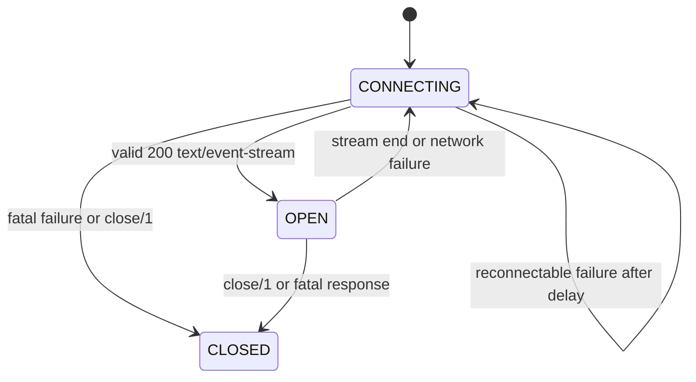

# HTTP EventSource App Design

## Goal

Add a sibling Mix child app named `:http_event_source` that exposes a
browser-like Server-Sent Events client API for Elixir. The public API should
follow the browser `EventSource` surface where it maps cleanly:

- constructor-style connection start
- `close/1`
- `url`, `with_credentials`, and `ready_state` accessors
- `CONNECTING`, `OPEN`, and `CLOSED` ready-state constants
- `open`, `message`, custom message-type, and `error` events
- automatic reconnection with `Last-Event-ID`

The implementation should stay compatible with this umbrella's current shape:
`http_fetch` remains the browser-like Fetch API app, `http_web_socket` owns
WebSocket behavior, and `http_event_source` owns long-lived event-stream
connections, SSE parsing, reconnection state, and event delivery.

## Standards Baseline

Use the WHATWG HTML Server-Sent Events section as the compatibility target.

Key compatibility points:

- A new event source starts in `CONNECTING` with numeric value `0`, transitions
  to `OPEN` `1` after a valid `200 text/event-stream` response, and transitions
  to `CLOSED` `2` after `close/1` or a fatal failure. Content-Type parameters
  such as `charset=utf-8` should be accepted.
- The constructor accepts a URL and optional init dictionary. The only browser
  init option is `withCredentials`, defaulting to `false`.
- The request is a `GET` request. It should send `Accept: text/event-stream`
  and avoid caches.
- A `204 No Content` response stops reconnection. Other network ends after a
  successful stream should reconnect unless the source is already closed.
- `retry:` stream fields update the reconnection delay when the value is ASCII
  digits.
- `id:` fields update the stored last event ID unless the value contains a NUL
  byte. Reconnect attempts include `Last-Event-ID` when that stored value is
  not empty.
- Event streams are UTF-8 text. Lines can end with CRLF, LF, or CR.
- Blank lines dispatch the current event. Comments that start with `:` are
  ignored.
- The default event type is `"message"`. `event:` fields override the type for
  the next dispatched event.

## App Boundary

Create a new child app:

```text
apps/http_event_source/
  .formatter.exs
  mix.exs
  lib/http_event_source.ex
  lib/http_event_source/application.ex
  lib/http/event_source.ex
  lib/http/event_source/connection.ex
  lib/http/event_source/event.ex
  lib/http/event_source/options.ex
  lib/http/event_source/parser.ex
  lib/http/event_source/telemetry.ex
  test/http/event_source_test.exs
  test/http/event_source/options_test.exs
  test/http/event_source/parser_test.exs
  test/http/event_source/telemetry_test.exs
  test/support/event_source_server.ex
```

`http_event_source` should depend on `http_fetch` in the umbrella so it can
reuse:

- `HTTP.Headers`
- `HTTP.HTTP1`
- `HTTP.Request`
- `HTTP.Transport.TCP`
- `HTTP.Transport.SSL`
- `HTTP.Transport.Unix`

Do not implement EventSource by calling `HTTP.fetch/2` and then consuming a
streamed `HTTP.Response`. `HTTP.fetch/2` has finite request timeout semantics
and returns a response abstraction intended for regular HTTP bodies. EventSource
needs a process that owns a long-lived connection, can transition between
`OPEN` and `CONNECTING` repeatedly, preserves the last event ID, and emits
events as the stream is parsed.

It is still reasonable to reuse `HTTP.HTTP1` as the response parser and
`HTTP.Request.to_iodata/1` for request serialization if the resulting request
headers are correct for SSE. If that helper remains too response-oriented, add a
small `HTTP.EventSource.Request` module inside the new app rather than changing
fetch behavior.

## Public API

Use `HTTP.EventSource` as the browser-facing module.

```elixir
source = HTTP.EventSource.new("https://example.com/events")

receive do
  {HTTP.EventSource, ^source, %HTTP.EventSource.Event.Open{}} ->
    :ok

  {HTTP.EventSource, ^source, %HTTP.EventSource.Event.Message{data: data}} ->
    IO.inspect(data)

  {HTTP.EventSource, ^source, %HTTP.EventSource.Event.Error{reason: reason}} ->
    IO.inspect(reason)
end
```

### Constructor

```elixir
@spec new(String.t() | URI.t(), keyword() | map()) :: t() | {:error, term()}
def new(url, init \\ [])
```

Browser parity:

- starts connecting immediately
- returns a source object immediately after synchronous URL and option
  validation
- returns `{:error, reason}` for invalid constructor input instead of raising a
  browser `DOMException`
- emits `open` later if the stream response is accepted
- emits `error` for reconnectable failures and fatal failures

Browser init options:

- `:with_credentials` or `"withCredentials"` - stored and returned by
  `with_credentials/1`, default `false`

Elixir extensions in `init`:

- `:owner` - process receiving events, defaults to `self()`
- `:headers` - additional request headers, default `[]`
- `:last_event_id` - initial last event ID, default `""`
- `:reconnect_time` - initial reconnect time in milliseconds, default `3_000`
- `:max_reconnect_time` - optional reconnect cap for Elixir backoff, default
  `30_000`
- `:connect_timeout` - default from config
- `:idle_timeout` - maximum silence while open, default `:infinity`
- `:ssl` - passed to `HTTP.Transport.SSL`
- `:socket_opts` - passed to the selected socket transport
- `:unix_socket` - Unix Domain Socket path, matching `HTTP.fetch/2`
- `:max_line_size` - parser guardrail, default `64 * 1024`

Keep options flat, matching `HTTP.fetch/2`. Do not add `options:`, `opts:`, or
`client_opts:` buckets.

### Accessors

Expose browser-style values using Elixir naming:

```elixir
HTTP.EventSource.url(source)              # "https://example.com/events"
HTTP.EventSource.with_credentials(source) # false
HTTP.EventSource.ready_state(source)      # 0 | 1 | 2
```

Also expose constants:

```elixir
HTTP.EventSource.connecting() # 0
HTTP.EventSource.open()       # 1
HTTP.EventSource.closed()     # 2
```

Optional diagnostic accessors can be added as Elixir extensions after the MVP:

```elixir
HTTP.EventSource.last_event_id(source)
HTTP.EventSource.reconnect_time(source)
```

These are useful for tests and observability, but they are not browser
properties.

### Closing

```elixir
@spec close(t()) :: :ok
def close(source)
```

Rules:

- if already closed, return `:ok`
- close the underlying transport immediately
- cancel any reconnect timer
- set `ready_state` to `CLOSED`
- do not emit a browser `close` event; EventSource only has `open`, `message`,
  and `error`

## Event Model

Browsers use `EventTarget`; Elixir should use process messages as the primary
API. The source process sends events to `init[:owner]`:

```elixir
{HTTP.EventSource, source, %HTTP.EventSource.Event.Open{}}
{HTTP.EventSource, source, %HTTP.EventSource.Event.Message{}}
{HTTP.EventSource, source, %HTTP.EventSource.Event.Error{}}
```

Event structs:

```elixir
defmodule HTTP.EventSource.Event.Open do
  defstruct [:target, type: "open"]
end

defmodule HTTP.EventSource.Event.Message do
  defstruct [:target, type: "message", data: "", origin: "", last_event_id: ""]
end

defmodule HTTP.EventSource.Event.Error do
  defstruct [:target, type: "error", reason: nil]
end
```

`type` mirrors the browser event name. For custom event types, emit
`%Message{type: "custom"}` rather than defining a separate struct per event
name:

```elixir
event: add
data: 123

{HTTP.EventSource, source, %HTTP.EventSource.Event.Message{type: "add", data: "123"}}
```

Optional callback/listener helpers can be added later, but the source process
must not execute user callbacks directly. Running arbitrary callback code in the
connection process would make one slow or crashing callback take down the stream.

## Process Architecture

One process per EventSource connection is justified because it owns:

- a live TCP/TLS/Unix socket
- mutable ready state
- reconnection timer state
- current reconnect delay
- last event ID
- active response parser
- active SSE parser buffers

Application supervision:

```elixir
children = [
  {DynamicSupervisor, strategy: :one_for_one, name: HTTP.EventSource.ConnectionSupervisor},
  {Registry, keys: :unique, name: HTTP.EventSource.Registry}
]
```

Connection children should use `restart: :temporary`. Automatic reconnection is
part of the logical EventSource object and should be handled inside
`HTTP.EventSource.Connection`; an OTP restart would lose last-event-ID and could
emit duplicate lifecycle events.

`HTTP.EventSource.new/2` starts a `HTTP.EventSource.Connection` under the
dynamic supervisor and returns a lightweight
`%HTTP.EventSource{pid: pid, ref: ref, url: url, with_credentials: boolean}`.
The connection process connects in `handle_continue/2` so `new/2` can return
before the network request completes.

## Connection Lifecycle



Implementation notes:

- `CONNECTING`: build request, include `Last-Event-ID` when set, connect socket,
  send request, parse HTTP response headers.
- `OPEN`: set socket `active: :once`, feed body chunks into the SSE parser, emit
  parsed events, and update last event ID / reconnect time.
- `CONNECTING` after failure: emit `error`, close any old transport, wait the
  current reconnect delay, and retry if still not `CLOSED`.
- `CLOSED`: close the transport, cancel timers, and stop normally.

Fatal responses:

- `204` means stop reconnecting and transition to `CLOSED`.
- Non-`200` responses fail the EventSource permanently.
- A `200` response with a non-`text/event-stream` content type fails
  permanently.
- Invalid HTTP framing fails permanently unless there is clear evidence it is a
  transient network close before any response was accepted.

Reconnectable cases:

- network error before response when the failure is plausibly transient
- EOF after an accepted event stream
- transport error after an accepted event stream

## Request Design

Each connection attempt should send a `GET` request with:

- `Accept: text/event-stream`
- `Cache-Control: no-cache` or equivalent no-store behavior
- user-provided headers
- `Last-Event-ID: <id>` when the stored ID is not empty

URL support:

- accept `http` and `https`
- reject unsupported schemes by default
- support `unix_socket: "/path/to.sock"` as an Elixir extension while requiring
  an HTTP URL for request-target and Host header construction
- reject invalid absolute URLs synchronously

Redirect behavior:

- default to `:follow`, matching `HTTP.fetch/2`
- support `:manual` and `:error` as flat Elixir extension options only if they
  can be implemented without surprising browser-like behavior
- strip sensitive headers across cross-origin redirects if redirect following is
  implemented locally

`with_credentials` is stored for browser API compatibility. In Elixir there is
no browser cookie jar or CORS layer, so it should not implicitly add cookies.
Callers can pass explicit `Cookie` or `Authorization` headers through
`init[:headers]`.

## Parser Design

`HTTP.EventSource.Parser` is pure. It should expose:

```elixir
new(max_line_size: 64 * 1024)
parse(parser, binary)
close(parser)
```

Parser events:

```elixir
{:event, type :: String.t(), data :: String.t(), last_event_id :: String.t()}
{:retry, non_neg_integer()}
{:last_event_id, String.t()}
```

Parser state:

- pending binary buffer
- whether a leading UTF-8 BOM has already been handled
- data buffer
- event type buffer
- last event ID buffer
- max line size

Parsing rules:

- decode completed lines as UTF-8 and reject invalid UTF-8 with
  `{:error, :invalid_utf8}` without rejecting a multibyte codepoint that is
  merely split across chunks
- strip exactly one leading BOM if present
- accept CRLF, LF, and CR line endings, including line endings split across
  socket chunks
- enforce `max_line_size` before buffering unbounded data
- ignore comment lines beginning with `:`
- split fields on the first `:`
- remove one leading space from the value after `:`, when present
- compare field names literally; do not downcase
- `event` sets the event type buffer
- `data` appends the value plus `"\n"` to the data buffer
- `id` sets the last event ID buffer unless the value contains NUL
- `retry` emits `{:retry, ms}` only when the value is all ASCII digits
- unknown fields are ignored
- a blank line dispatches only when the data buffer is non-empty
- an ID-only block emits `{:last_event_id, id}` so reconnect attempts can still
  use the updated ID
- dispatch removes the final appended newline from `data`
- `close/1` discards any incomplete final event rather than dispatching it

The connection process, not the parser, should own the public last-event-ID
value. When the parser emits an event, the connection updates its stored last
event ID to the emitted `last_event_id` and includes that value on future
reconnects.

## Telemetry

Use a separate telemetry prefix:

- `[:http_event_source, :connect, :start]`
- `[:http_event_source, :connect, :stop]`
- `[:http_event_source, :connect, :exception]`
- `[:http_event_source, :message, :received]`
- `[:http_event_source, :reconnect, :start]`
- `[:http_event_source, :reconnect, :stop]`
- `[:http_event_source, :close, :stop]`

Suggested metadata:

- `url`
- `scheme`
- `host`
- `port`
- `ready_state`
- `event_type`
- `last_event_id`
- `status`
- `error`

Suggested measurements:

- `duration`
- `bytes`
- `reconnect_time`
- `attempt`

## Compatibility Matrix

| Browser API | Elixir API | Phase |
| --- | --- | --- |
| `new EventSource(url)` | `HTTP.EventSource.new(url)` | MVP |
| `new EventSource(url, { withCredentials })` | `HTTP.EventSource.new(url, with_credentials: true)` | MVP |
| `source.close()` | `HTTP.EventSource.close(source)` | MVP |
| `source.url` | `HTTP.EventSource.url(source)` | MVP |
| `source.withCredentials` | `HTTP.EventSource.with_credentials(source)` | MVP |
| `source.readyState` | `HTTP.EventSource.ready_state(source)` | MVP |
| `CONNECTING`, `OPEN`, `CLOSED` | `connecting/0`, `open/0`, `closed/0` | MVP |
| `open` event | `%HTTP.EventSource.Event.Open{}` message | MVP |
| `message` event | `%HTTP.EventSource.Event.Message{type: "message"}` message | MVP |
| custom event names | `%HTTP.EventSource.Event.Message{type: name}` message | MVP |
| `error` event | `%HTTP.EventSource.Event.Error{}` message | MVP |
| `addEventListener` | callback/listener helper | Later |
| browser CORS/cookie handling | explicit headers only | Not planned |

## Tests

Scoped tests for the first implementation:

- URL validation accepts `http` and `https`, rejects unsupported schemes, and
  preserves the serialized URL.
- Option validation supports `with_credentials`, owner, headers, timeouts,
  initial last event ID, and Unix sockets.
- Constructor returns immediately with `ready_state == CONNECTING`.
- Successful `200 text/event-stream` emits `open` and sets ready state to
  `OPEN`.
- `204 No Content` emits `error` if appropriate and stops reconnecting.
- Non-`200` status fails permanently.
- Wrong content type fails permanently.
- Parser handles LF, CRLF, CR, comments, fields without colons, fields with one
  optional leading space, and chunk boundaries inside lines.
- Parser dispatches multi-line data with newlines preserved.
- Parser supports custom `event:` names.
- Parser ignores unknown fields.
- Parser updates `id`, rejects NUL-containing IDs, and resets ID on empty `id`.
- Reconnect sends `Last-Event-ID` after an event with `id`.
- `retry:` updates reconnect delay only for ASCII digit values.
- EOF after an accepted stream reconnects and emits an `error` event before
  retrying.
- `close/1` closes the socket, cancels reconnect timers, sets ready state to
  `CLOSED`, and prevents future events.
- Telemetry emits connect, message, reconnect, and close events with stable
  metadata.

Run only scoped tests while developing the app:

```sh
mix test apps/http_event_source/test
mix compile --warnings-as-errors
mix format --check-formatted
```

## Implementation Plan

1. Scaffold `apps/http_event_source` with `mix.exs`, application module,
   formatter, and dependency on `:http_fetch`.
2. Add public `HTTP.EventSource` struct, constants, constructor, accessors, and
   `close/1`.
3. Add pure `Options` and `Parser` modules with unit tests first.
4. Add `Connection` process with HTTP response validation, active socket receive
   loop, reconnection timer, and close handling.
5. Add event structs and owner-process event delivery.
6. Add telemetry events and documentation.
7. Add README examples and include the app in umbrella docs.

## Open Decisions

- Should invalid constructor input return `{:error, reason}` or raise? The rest
  of this umbrella prefers returned errors, so the initial design should return
  error tuples for synchronous validation failures.
- Should `with_credentials` stay a stored compatibility property only, or should
  it later integrate with an explicit cookie jar? The MVP should store it only.
- Should reconnect backoff be exactly the current reconnect time, or should the
  Elixir client add capped backoff after repeated transport failures? Browser
  implementations may wait longer than the current reconnect time; the MVP can
  support a small capped backoff as an Elixir extension if tests keep the base
  `retry:` semantics clear.
- Should EventSource use `HTTP.HTTP1.serialize_request/1` if it emits
  `Connection: close`? That header does not prevent a long-lived response, but a
  dedicated request builder may be clearer for SSE.

## References

- WHATWG HTML, Server-sent events:
  https://html.spec.whatwg.org/multipage/server-sent-events.html
- MDN, EventSource:
  https://developer.mozilla.org/en-US/docs/Web/API/EventSource
