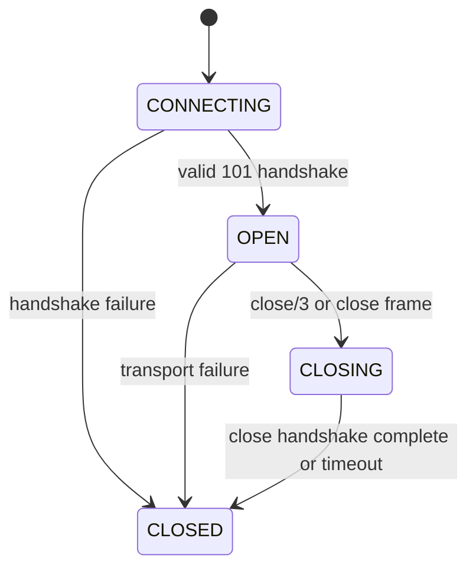

# HTTP WebSocket App Design

## Goal

Add a sibling Mix child app named `:http_web_socket` that exposes a
browser-like WebSocket client API for Elixir. The public API should follow the
browser `WebSocket` surface where it maps cleanly:

- constructor-style connection start
- `send/2`
- `close/1`, `close/2`, `close/3`
- `ready_state`, `buffered_amount`, `extensions`, `protocol`, `binary_type`,
  and `url` accessors
- `open`, `message`, `error`, and `close` events

The implementation should stay compatible with this umbrella's current shape:
`http_fetch` remains the browser-like Fetch API app, while `http_web_socket`
owns WebSocket handshake, framing, connection state, and event delivery.

## Standards Baseline

Use the WebSockets Standard API as the compatibility target and RFC 6455 as the
wire protocol target.

Key compatibility points:

- A new socket starts in `CONNECTING` with numeric value `0`, then transitions
  through `OPEN` `1`, `CLOSING` `2`, and `CLOSED` `3`.
- Constructor input allows `ws`, `wss`, `http`, and `https`; `http` maps to
  `ws`, and `https` maps to `wss`.
- URLs with fragments are invalid.
- `send/2` fails while connecting, uses text frames for plain Elixir binaries,
  uses binary frames for explicit binary wrappers, and updates
  `buffered_amount` by application payload bytes.
- `close/3` accepts code `1000` or `3000..4999`; the reason must encode to at
  most 123 bytes.
- Browser ping and pong are not exposed to application code. The client should
  answer server ping frames automatically.
- Client-to-server frames must be masked. Server-to-client frames must not be
  masked.

## App Boundary

Create a new child app:

```text
apps/http_web_socket/
  mix.exs
  lib/http_web_socket.ex
  lib/http_web_socket/application.ex
  lib/http/web_socket.ex
  lib/http/web_socket/connection.ex
  lib/http/web_socket/event.ex
  lib/http/web_socket/frame.ex
  lib/http/web_socket/handshake.ex
  lib/http/web_socket/array_buffer.ex
  lib/http/web_socket/options.ex
  lib/http/web_socket/telemetry.ex
  test/http/web_socket_test.exs
  test/http/web_socket/frame_test.exs
  test/http/web_socket/handshake_test.exs
```

`http_web_socket` should depend on `http_core` in the umbrella so it can reuse:

- `HTTP.Headers`
- `HTTP.Blob`
- `HTTP.Transport.TCP`
- `HTTP.Transport.SSL`

Do not route WebSocket upgrades through `HTTP.fetch/2`. `HTTP.HTTP1` currently
treats `101 Switching Protocols` as unsupported, and fetch should keep that
response-oriented behavior. WebSocket needs a dedicated handshake parser that
switches into frame mode after successful upgrade.

## Public API

Use `HTTP.WebSocket` as the browser-facing module.

```elixir
socket = HTTP.WebSocket.new("wss://example.com/socket", ["chat.v1"], owner: self())

receive do
  {HTTP.WebSocket, ^socket, %HTTP.WebSocket.Event.Open{}} ->
    :ok = HTTP.WebSocket.send(socket, "hello")

  {HTTP.WebSocket, ^socket, %HTTP.WebSocket.Event.Message{data: data}} ->
    IO.inspect(data)

  {HTTP.WebSocket, ^socket, %HTTP.WebSocket.Event.Close{code: code, reason: reason}} ->
    IO.inspect({code, reason})
end
```

### Constructor

```elixir
@spec new(String.t() | URI.t(), String.t() | [String.t()], keyword()) ::
        t() | {:error, term()}
def new(url, protocols \\ [], init \\ [])
```

Browser parity:

- starts connecting immediately
- returns a socket object immediately after synchronous URL/protocol validation
- returns `{:error, reason}` for invalid constructor input instead of raising a
  browser `DOMException`
- emits an `open` event later if the handshake succeeds
- emits `error` and `close` events if the connection cannot be established

Elixir extensions in `init`:

- `:owner` - process receiving events, defaults to `self()`
- `:binary_type` - `:blob` or `:array_buffer`, defaults to `:blob`
- `:headers` - additional handshake headers, default `[]`
- `:connect_timeout` - default from config
- `:timeout` - overall connection operation timeout where applicable
- `:ssl` - passed to `HTTP.Transport.SSL`
- `:socket_opts` - passed to the selected socket transport
- `:max_message_size` - default from config, closes with `1009` when exceeded

Keep options flat, matching `HTTP.fetch/2`. Do not add `options:`, `opts:`, or
`client_opts:` buckets.

### Accessors

Expose browser-style values using Elixir naming:

```elixir
HTTP.WebSocket.url(socket)             # "wss://example.com/socket"
HTTP.WebSocket.ready_state(socket)     # 0 | 1 | 2 | 3
HTTP.WebSocket.buffered_amount(socket) # non_neg_integer()
HTTP.WebSocket.extensions(socket)      # ""
HTTP.WebSocket.protocol(socket)        # selected subprotocol or ""
HTTP.WebSocket.binary_type(socket)     # :blob | :array_buffer
HTTP.WebSocket.set_binary_type(socket, :array_buffer)
```

Also expose constants:

```elixir
HTTP.WebSocket.connecting() # 0
HTTP.WebSocket.open()       # 1
HTTP.WebSocket.closing()    # 2
HTTP.WebSocket.closed()     # 3
```

### Sending

```elixir
@spec send(t(), String.t() | HTTP.Blob.t() | HTTP.WebSocket.ArrayBuffer.t()) ::
        :ok | {:error, term()}
def send(socket, data)
```

Rules:

- if `ready_state == CONNECTING`, return `{:error, :invalid_state}`
- if `ready_state in [CLOSING, CLOSED]`, do not transmit and still increase
  `buffered_amount`, matching browser semantics
- plain Elixir binaries are treated as strings and send as text frames after
  UTF-8 validation
- `HTTP.Blob` sends as binary frames using its data
- `HTTP.WebSocket.ArrayBuffer` sends as binary frames using its data
- increment `buffered_amount` by application payload bytes before enqueue
- decrement `buffered_amount` after the frame has been written to the transport
- if the internal send buffer limit is exceeded, send an error event and start
  close handling

Elixir cannot distinguish JavaScript `String` and `ArrayBuffer` values from a
single bare binary at runtime. Keep `send/2` as the browser-like method name,
but require an explicit wrapper for binary frames:

```elixir
HTTP.WebSocket.send(socket, "hello")
HTTP.WebSocket.send(socket, HTTP.WebSocket.array_buffer(<<0, 1, 2>>))
HTTP.WebSocket.send(socket, HTTP.Blob.new(<<0, 1, 2>>))
```

### Closing

```elixir
HTTP.WebSocket.close(socket)
HTTP.WebSocket.close(socket, 1000)
HTTP.WebSocket.close(socket, 1000, "done")
```

Rules:

- allowed close codes are `1000` or `3000..4999`
- reject reserved or protocol-only codes such as `1005`, `1006`, and `1015`
- reject reasons longer than 123 UTF-8 bytes
- if already closing or closed, do nothing
- if still connecting, fail the opening handshake and emit close
- if open, enqueue all pending sends first, then send a close frame

## Event Model

Browsers use `EventTarget`; Elixir should use process messages as the primary
API. The socket process sends events to `init[:owner]`:

```elixir
{HTTP.WebSocket, socket, %HTTP.WebSocket.Event.Open{}}
{HTTP.WebSocket, socket, %HTTP.WebSocket.Event.Message{}}
{HTTP.WebSocket, socket, %HTTP.WebSocket.Event.Error{}}
{HTTP.WebSocket, socket, %HTTP.WebSocket.Event.Close{}}
```

Event structs:

```elixir
defmodule HTTP.WebSocket.Event.Open do
  defstruct [:target, :type]
end

defmodule HTTP.WebSocket.Event.Message do
  defstruct [:target, :type, :data, :origin]
end

defmodule HTTP.WebSocket.Event.Error do
  defstruct [:target, :type, :reason]
end

defmodule HTTP.WebSocket.Event.Close do
  defstruct [:target, :type, :code, :reason, :was_clean]
end
```

`type` should be `"open"`, `"message"`, `"error"`, or `"close"` to mirror the
browser event name. `target` should be the `HTTP.WebSocket` struct returned by
`new/3`.

Optional callback helpers can be added later, but the socket owner process must
not execute user callbacks directly. Running arbitrary callback code in the
socket owner would make one slow or crashing callback take down the connection.

## Process Architecture

One process per WebSocket connection is justified because it owns:

- a live TCP/TLS socket
- mutable ready state
- selected protocol/extensions
- send queue and `buffered_amount`
- fragmented receive message state
- close handshake state

Use an OTP process for the connection, but do not restart closed connections.
A restart would create a new logical WebSocket without the caller asking for it.

Application supervision:

```elixir
children = [
  {DynamicSupervisor, strategy: :one_for_one, name: HTTP.WebSocket.ConnectionSupervisor},
  {Registry, keys: :unique, name: HTTP.WebSocket.Registry}
]
```

Connection children should use `restart: :temporary`.

`HTTP.WebSocket.new/3` starts a `HTTP.WebSocket.Connection` under the dynamic
supervisor and returns a lightweight `%HTTP.WebSocket{pid: pid, ref: ref, ...}`.
The connection process connects in `handle_continue/2` so `new/3` can return
before the network handshake completes.

## Connection Lifecycle



Implementation notes:

- `CONNECTING`: validate URL and protocols, connect TCP/TLS, send opening
  handshake, parse response headers, validate `Sec-WebSocket-Accept`.
- `OPEN`: activate socket with `active: :once`, parse frames, deliver complete
  messages, drain queued sends.
- `CLOSING`: preserve already queued sends before the close frame where
  possible; respond to a peer close with a close frame if not already sent.
- `CLOSED`: close the transport, emit final close event once, and stop the
  connection process normally.

## Handshake Design

`HTTP.WebSocket.Handshake` is pure. It should expose:

```elixir
build_request(uri, protocols, headers, key)
accept_key(key)
validate_response(status, headers, key, requested_protocols)
```

Request requirements:

- `GET <path-and-query> HTTP/1.1`
- `Host`
- `Upgrade: websocket`
- `Connection: Upgrade`
- `Sec-WebSocket-Key`
- `Sec-WebSocket-Version: 13`
- optional `Sec-WebSocket-Protocol`
- optional caller headers

Validation requirements:

- status must be `101`
- `Upgrade` must include `websocket`
- `Connection` must include `upgrade`
- `Sec-WebSocket-Accept` must match `Base.encode64(:crypto.hash(:sha, key <> guid))`
- selected protocol must be one requested by the caller
- extensions default to unsupported; reject any unexpected
  `Sec-WebSocket-Extensions` response

## Frame Design

`HTTP.WebSocket.Frame` is pure. It should expose:

```elixir
encode(:text | :binary | :close | :ping | :pong, payload, client?: true)
new_parser()
parse(parser, binary)
```

Parser events:

```elixir
{:message, :text, binary()}
{:message, :binary, binary()}
{:close, code :: non_neg_integer() | nil, reason :: binary()}
{:ping, binary()}
{:pong, binary()}
```

Validation:

- clients must mask outgoing frames with fresh random 32-bit masking keys
- server frames must be unmasked
- RSV bits must be zero until extensions are implemented
- unknown opcodes fail with close code `1002`
- control frames must not be fragmented and must have payload length <= 125
- text messages must be valid UTF-8, otherwise close with `1007`
- messages larger than `max_message_size` close with `1009`
- fragmented messages are reassembled before a message event is delivered

## Telemetry

Use a separate telemetry prefix:

- `[:http_web_socket, :connect, :start]`
- `[:http_web_socket, :connect, :stop]`
- `[:http_web_socket, :connect, :exception]`
- `[:http_web_socket, :message, :received]`
- `[:http_web_socket, :message, :sent]`
- `[:http_web_socket, :close, :start]`
- `[:http_web_socket, :close, :stop]`

Suggested metadata:

- `url`
- `scheme`
- `host`
- `port`
- `protocol`
- `ready_state`
- `close_code`
- `error`

Suggested measurements:

- `duration`
- `bytes`
- `buffered_amount`

## Compatibility Matrix

| Browser API | Elixir API | Phase |
| --- | --- | --- |
| `new WebSocket(url)` | `HTTP.WebSocket.new(url)` | MVP |
| `new WebSocket(url, protocols)` | `HTTP.WebSocket.new(url, protocols)` | MVP |
| `socket.send(data)` | `HTTP.WebSocket.send(socket, data)` | MVP |
| `socket.close(code, reason)` | `HTTP.WebSocket.close(socket, code, reason)` | MVP |
| `socket.readyState` | `HTTP.WebSocket.ready_state(socket)` | MVP |
| `socket.bufferedAmount` | `HTTP.WebSocket.buffered_amount(socket)` | MVP |
| `socket.protocol` | `HTTP.WebSocket.protocol(socket)` | MVP |
| `socket.extensions` | `HTTP.WebSocket.extensions(socket)` | MVP, returns `""` |
| `socket.binaryType` | `HTTP.WebSocket.binary_type/1`, `set_binary_type/2` | MVP |
| `open` event | `%HTTP.WebSocket.Event.Open{}` message | MVP |
| `message` event | `%HTTP.WebSocket.Event.Message{}` message | MVP |
| `error` event | `%HTTP.WebSocket.Event.Error{}` message | MVP |
| `close` event | `%HTTP.WebSocket.Event.Close{}` message | MVP |
| `addEventListener` | callback/listener helper | Later |
| permessage-deflate | extension negotiation | Later |

## Tests

Scoped tests for the first implementation:

- URL validation accepts `ws`, `wss`, `http`, `https`, maps schemes correctly,
  and rejects fragments.
- Protocol validation rejects duplicate or invalid protocol tokens.
- Handshake request includes required headers.
- Handshake response validates `Sec-WebSocket-Accept`.
- Frame encoder masks client frames and uses minimal payload length encoding.
- Frame parser rejects masked server frames and unknown opcodes.
- Control frame parser enforces payload size and fragmentation rules.
- Text receive rejects invalid UTF-8 with close code `1007`.
- Public API emits `open`, `message`, `error`, and `close` events in order.
- `send/2` returns `{:error, :invalid_state}` while connecting.
- `close/3` validates code and reason limits.
- `buffered_amount/1` increments before queue drain and decrements after send.

Run only scoped tests while developing the app:

```sh
mix test apps/http_web_socket/test
mix compile --warnings-as-errors
mix format --check-formatted
```

## Implementation Plan

1. Scaffold `apps/http_web_socket` with `mix.exs`, application module, formatter,
   and dependency on `:http_fetch`.
2. Add public `HTTP.WebSocket` struct, constants, constructor, accessors,
   `send/2`, and `close/1..3`.
3. Add pure `Handshake` and `Frame` modules with unit tests first.
4. Add `Connection` process with dedicated handshake and active socket receive
   loop.
5. Add event structs and owner-process event delivery.
6. Add telemetry events and documentation.
7. Add README examples and include the app in umbrella docs.

## Open Decisions

- Should `HTTP.WebSocket.new/3` raise on invalid constructor input to mirror
  browser exceptions, or return a socket that emits `error` and `close`? The
  fetch app generally uses returned error tuples, so the initial design should
  prefer `{:error, reason}` from validation helpers and only return a socket
  after synchronous constructor validation passes.
- Should additional headers be supported in the MVP? Browsers do not expose
  custom handshake headers, but Elixir service clients often need them. The
  design includes `init[:headers]` as an Elixir extension.
- Should binary default to `:blob` for browser parity or `:array_buffer` for
  Elixir ergonomics? The design defaults to `:blob` because `HTTP.Blob` already
  exists and the user requested browser API compatibility.

## References

- WebSockets Standard: https://websockets.spec.whatwg.org/
- RFC 6455, The WebSocket Protocol: https://datatracker.ietf.org/doc/html/rfc6455
